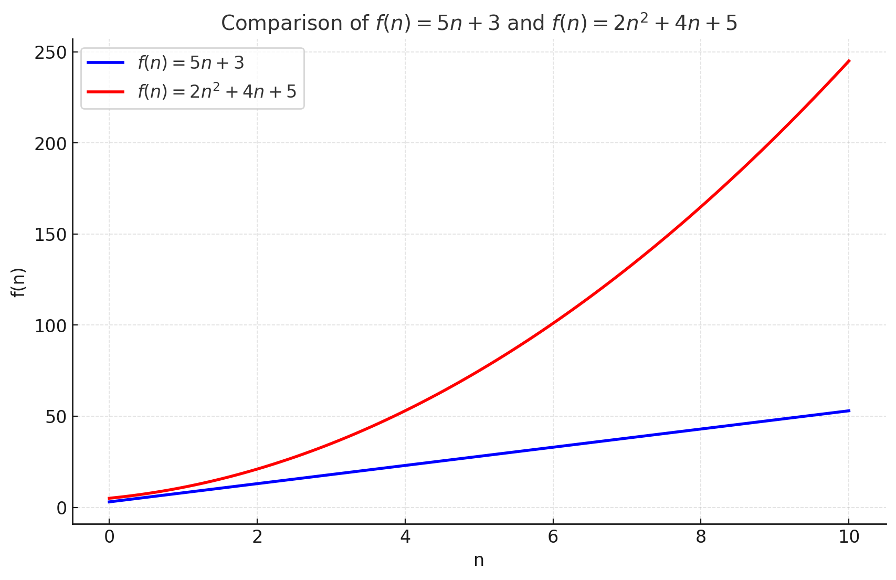

# [BR] Custo do Algoritmo

## Como Calcular a Função de Custo de um Algoritmo

Quando projetamos algoritmos, um aspecto essencial é compreender o custo associado à sua execução. Essa análise nos permite prever como o algoritmo se comportará ao lidar com diferentes tamanhos de entrada, ajudando a identificar possíveis gargalos de performance. Neste guia, exploraremos os passos para calcular a função de custo de um algoritmo de forma detalhada.

---

## 1. Entenda o Problema e o Tamanho da Entrada

O primeiro passo é identificar o problema que o algoritmo resolve e quais são as entradas que influenciam seu desempenho.

- **O que o algoritmo faz?** Determine a tarefa realizada (ex.: ordenar uma lista, buscar um elemento, calcular a soma de números).
- **Qual é o tamanho da entrada?** Defina a variável que representa o tamanho da entrada. Exemplos:
  - Para listas ou arrays: o número de elementos ($n$).
  - Para matrizes: dimensões ($m$ x $n$).
  - Para grafos: o número de vértices ($V$) ou arestas ($E$).
  - Para strings: o comprimento da string.

> **Exemplo:** Em um algoritmo que soma os elementos de uma lista, o tamanho da entrada é o número de elementos na lista ($n$).

---

## 2. Analise o Algoritmo Passo a Passo

Percorra o algoritmo linha por linha e identifique as operações executadas. Considere:

- **Inicializações:** Declarações de variáveis, como `sum := 0`.
- **Iterações:** Loops (`for`, `while`) e suas repetições com base no tamanho da entrada.
- **Operações internas:** Comparações, atribuições, somas, chamadas de funções, etc.

Para simplificar a analise, consideraremos que as seguintes operações possuem o mesmo custo de valor $1$:

- declaração de variáveis;
- acesso a elementos em arrays;
- comparações de valores;
- incrementos de valores;
- operações aritméticas básicas.

> **Exemplo:**
> Em um loop que percorre uma lista de tamanho $n$, cada iteração executa uma operação. Se o loop roda de 1 até $n$, ele realiza exatamente $n$ operações.

---

## 3. Categorize as Operações

Classifique as operações em dois tipos:

1. **Constantes:** Operações que são executadas uma única vez, independentemente do tamanho da entrada (ex.: inicialização de variáveis).
2. **Dependentes:** Operações que dependem do tamanho da entrada ($n$).

> **Exemplo:**
>
> - $sum := 0$ (constante).
> - Loop que percorre uma lista com $n$ elementos (dependente de $n$).

---

## 4. Encontre a Soma Total de Operações

Calcule a soma de todas as operações realizadas pelo algoritmo, separando os termos constantes e dependentes:

### 4.1. Exemplo Linear: Soma de Elementos

> **Algoritmo:**

```go
// algoritmo feito em golang
func sumList(list []int) int {
    var sum int                 // 1 operação constante

    for i := 0; i < len(list); i++ { // 2 operações por iteração
        sum += list[i]      // 3 operações por iteração
    }
    return sum
}
```

#### 4.1.1 Contagem de Operações

1. **Declaração e inicialização:** da variável `sum := 0` → 1 operação.
2. **Inicialização do Loop:** Executado 1 vez independentemente do tamanho de $n$
    - Declaração da variável `i := 0` → 1 operação;
    - Comparação do valor de `i` com o tamanho do slice → 1 operação.
3. **Loop:** Executado $n$ vezes para uma lista com $n$ elementos.
    - Cada iteração realiza:
        - Acesso ao elemento do slice na posição `i` → 1 operação;
        - Soma do valor de `sum` com o valor `list[i]` → 1 operação;
        - Atribuição do novo valor de `sum` → 1 operação
4. **Fim de cada iteração:** Executado $n$ vezes para uma lista com $n$ elementos.
    - Adição da variável `i++` → 1 operação;
    - Comparação do valor de i com o tamanho do slice → 1 operação;
5. **Nota:** O custo de `len(list)` é considerado $0$ para fins didáticos.

**Total de operações:**

- Constante: `1 + 2`.
- Dependente: `n + n + n + n + n  = 5n`.

#### 4.1.2 Equação do Custo Total

**Função de custo:**
$$
f(n) = 5n + 3
$$

O algoritmo tem um comportamento **linear**, já que o termo dominante é proporcional a $n$.

### 4.2. Exemplo Quadrático: Comparação de Pares

> **Algoritmo:**

```go
// algoritmo feito em golang
func checkPairs(list []int) int {
    count := 0 
    for i := 0; i < len(list); i++ {
        for j := i + 1; j < len(list); j++ {
            if list[i] == list[j] {
                count++
            }
        }
    }
    return count
}
```

#### 4.2.1 Contagem de Operações

1. **Declaração e inicialização:** `count := 0` → 1 operação.
2. **Inicialização do Loop externo:** Executado 1 vez independentemente do tamanho de $n$
    - Declaração da variável `i := 0` → 1 operação;
    - Comparação do valor de `i` com o tamanho do slice → 1 operação.
3. **Inicialização do Loop interno:** Executado 1 vez independentemente do tamanho de $n$
    - Declaração da variável `j` e adição `j := i + 1` → 2 operações;
    - Comparação do valor de `j` com o tamanho do slice → 1 operação.
4. **Loop externo:** Executado $n$ vezes.
    - Para cada iteração, o **loop interno** executa $n-1$ vezes.
5. **Loop interno:**
    - Acesso aos valores do array e comparação: `list[i] == list[j]` → 3 operações por iteração.
    - Incremento condicional: `count++` (quando verdadeiro) → 1 operação.
6. **Fim de cada iteração do loop interno:** Executado $n - i$ vezes para uma lista com $n$ elementos.
    - Adição da variável `j++` → 1 operação;
    - Comparação do valor de `j` com o tamanho do slice → 1 operação.
7. **Fim de cada iteração do loop externo:** Executado $n$ vezes.
    - Adição da variável `i++` → 1 operação;
    - Comparação do valor de `i` com o tamanho do slice → 1 operação.
8. **Nota:** O custo de `len(list)` e `if` é considerado $0$ para fins didáticos.

**Total de operações:**

- Constante: `1 + 2 + 3 = 5`.
- Dependente:
  - Loop extrerno: `2n`
  - Loop Interno: `4 * (n - i)`

#### 4.2.2 Equação do Custo Total

#### Custo Total

É preciso somar os valores dos **custos constanstes**, do **loop externo** e do **loop interno**. Assim, a equação do custo total é dada por:
$$
f(n) = Constantes + Custo_{\text{loop externo}} + Custo_{\text{loop interno}}
$$

$$
f(n) = 5 + 2n + \sum_{i=0}^{n-1} 4 \cdot (n - i)
$$

---

#### Expansão do Somatório

Expandindo o somatório da segunda parcela:
$$
f(n) = 5 + 2n + 4 \cdot \sum_{i=0}^{n-1} (n - i)
$$

A soma $\sum_{i=0}^{n-1} (n - i)$  é uma **progressão aritmética**. Resolvida, temos:
$$
\sum_{i=0}^{n-1} (n - i) = n + (n - 1) + (n - 2) + \dots + 1 = \frac{n \cdot (n + 1)}{2}
$$

Substituindo na equação:
$$
f(n) = 5 + 2n + 4 \cdot \frac{n \cdot (n + 1)}{2}
$$

---

#### Simplificação

Simplificando o termo:
$$
f(n) = 5 + 2n + 2n \cdot (n + 1)
$$

Distribuindo:
$$
f(n) = 2n^2 + 2n + 2n + 5
$$

Resultado final:
$$
f(n) = 2n^2 + 4n + 5
$$

---

## 5. Interprete o Comportamento

A equação encontrada revela o comportamento do algoritmo. O que importa é a relação entre o tamanho da entrada ($n$) e o número de operações.

- **Linear:** Quando o custo cresce proporcionalmente a $n$ (ex.: soma de elementos).
- **Quadrático:** Quando o custo cresce proporcionalmente a $n^2$ (ex.: comparação de todos os pares em uma lista).

### 5.1. Utilize gráficos para visualizar os resultados

Para as funções de custo calculados na seção anterior temos as seguintes curvas.



---

## 6. Conclusão

Calcular a função de custo de um algoritmo é um processo que envolve compreender as operações realizadas e como elas escalam com o tamanho da entrada. Embora a equação exata seja útil, o mais importante é interpretar o comportamento geral do algoritmo para tomar decisões mais informadas sobre sua eficiência.

---

## 7. Instagram

No post do instagram [Algoritmos - Calcule o seu custo](https://www.instagram.com/p/DDpGEyUOhrj/?img_index=1) explico como calcular a função de custo de um algoritmo e qual a impotância disso.
