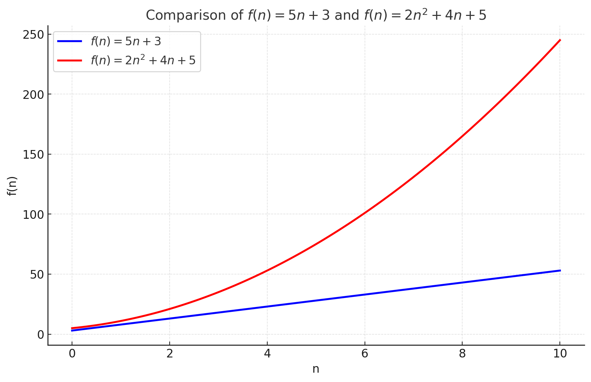

# [EN] Algorithm cost

## How to Calculate the Cost Function of an Algorithm

When designing algorithms, an essential aspect is understanding the cost associated with their execution. This analysis allows us to predict how the algorithm will behave when dealing with different input sizes, helping to identify potential performance bottlenecks. In this guide, we will explore the steps to calculate the cost function of an algorithm in detail.

### 1. Understand the Problem and the Input Size

The first step is to identify the problem that the algorithm solves and which inputs influence its performance.

- **What does the algorithm do?** Determine the task performed (e.g.: sort a list, search for an element, calculate the sum of numbers).
- **What is the input size?** Define the variable that represents the input size. Examples:
- For lists or arrays: the number of elements ($n$).
- For matrices: dimensions ($m$ x $n$).
- For graphs: the number of vertices ($V$) or edges ($E$).
- For strings: the length of the string.

> **Example:** In an algorithm that adds the elements of a list, the input size is the number of elements in the list ($n$).

### 2. Analyze the Algorithm Step by Step

Go through the algorithm line by line and identify the operations performed. Consider:

- **Initializations:** Variable declarations, such as `sum := 0`.
- **Iterations:** Loops (`for`, `while`) and their repetitions based on the input size.
- **Internal operations:** Comparisons, assignments, sums, function calls, etc.

To simplify the analysis, we will consider that the following operations have the same cost of $1$:
- variable declaration;
- accessing elements in arrays;
- comparing values;
- incrementing values;
- basic arithmetic operations.

> **Example:**
> In a loop that iterates through a list of size $n$, each iteration performs one operation. If the loop runs from 1 to $n$, it performs exactly $n$ operations.

### 3. Categorize the Operations

Classify the operations into two types:

1. **Constant:** Operations that are performed only once, regardless of the size of the input (e.g., initialization of variables).

2. **Dependent:** Operations that depend on the size of the input ($n$).

> **Example:**
> - $sum := 0$ (constant).
> - Loop that iterates through a list with $n$ elements (dependent on $n$).

### 4. Find the Total Sum of Operations

Calculate the sum of all operations performed by the algorithm, separating the constant and dependent terms:

#### 4.1. Linear Example: Sum of Elements

> **Algorithm:**
```go
// algorithm made in golang
func sumList(list []int) int {
var sum int // 1 constant operation

for i := 0; i < len(list); i++ { // 2 operations per iteration
sum += list[i] // 3 operations per iteration
}
return sum
}
```

#### Operation Count
1. **Declaration and initialization:** of the variable `sum := 0` → 1 operation.
2. **Loop Initialization:** Executed 1 time regardless of the size of $n$
- Declaration of the variable `i := 0` → 1 operation;
- Comparison of the value of `i` with the size of the slice → 1 operation.
3. **Loop:** Executed $n$ times for a list with $n$ elements.
- Each iteration performs:
- Access to the slice element at position `i` → 1 operation;
- Addition of the value of `sum` with the value of `list[i]` → 1 operation;
- Assignment of the new value of `sum` → 1 operation
4. **End of each iteration:** Executed $n$ times for a list with $n$ elements.
- Addition of the variable `i++` → 1 operation;
- Comparison of the value of i with the size of the slice → 1 operation;
5. **Note:** The cost of `len(list)` is considered $0$ for educational purposes.

**Total operations:**
- Constant: `1 + 2`.
- Dependent: `n + n + n + n + n = 5n`.

**Cost function:**
$$
f(n) = 5n + 3
$$

The algorithm has a **linear** behavior, since the dominant term is proportional to $n$.

### 4.2. Quadratic Example: Pairwise Comparison

> **Algorithm:**
```go
// algorithm written in golang
func checkPairs(list []int) int {
count := 0
for i := 0; i < len(list); i++ {
for j := i + 1; j < len(list); j++ {
if list[i] == list[j] {
count++
}
}
}
return count
}
```

### Counting Operations
1. **Declaration and initialization:** `count := 0` → 1 operation.
2. **Initialization of the outer loop:** Executed once regardless of the size of $n$
- Declaration of the variable `i := 0` → 1 operation; - Comparison of the value of `i` with the size of the slice → 1 operation.
3. **Initialization of the inner loop:** Executed 1 time regardless of the size of $n$
- Declaration of the variable `j` and addition `j := i + 1` → 2 operations;
- Comparison of the value of `j` with the size of the slice → 1 operation.
4. **Outer loop:** Executed $n$ times.
- For each iteration, the **inner loop** executes $n-1$ times.
5. **Inner loop:**
- Access to array values ​​and comparison: `list[i] == list[j]` → 3 operations per iteration.
- Conditional increment: `count++` (when true) → 1 operation.
6. **End of each iteration of the inner loop:** Executed $n - i$ times for a list with $n$ elements.
- Addition of the variable `j++` → 1 operation;
- Comparison of the value of `j` with the size of the slice → 1 operation.
7. **End of each iteration of the outer loop:** Executed $n$ times.
- Addition of the variable `i++` → 1 operation;
- Comparison of the value of `i` with the size of the slice → 1 operation.
8. **Note:** The cost of `len(list)` and `if` is considered $0$ for teaching purposes.

**Total operations:**
- Constant: `1 + 2 + 3 = 5`. - Dependent:
- External loop: `2n`
- Internal loop: `4 * (n - i)`

### Total Cost Equation

#### Total Cost:
You need to add the values ​​of the **constant costs**, the **external loop** and the **internal loop**. Thus, the total cost equation is given by:
$$
f(n) = Constants + Cost_{\text{outer loop}} + Cost_{\text{inner loop}}
$$

$$
f(n) = 5 + 2n + \sum_{i=0}^{n-1} 4 \cdot (n - i)
$$

---

#### Expanding the Summation:
Expanding the sum of the second part:
$$
f(n) = 5 + 2n + 4 \cdot \sum_{i=0}^{n-1} (n - i)
$$

The sum $\sum_{i=0}^{n-1} (n - i)$ is an **arithmetic progression**. Solved, we have:
$$
\sum_{i=0}^{n-1} (n - i) = n + (n - 1) + (n - 2) + \dots + 1 = \frac{n \cdot (n + 1)}{2}
$$

Substituting in the equation:
$$
f(n) = 5 + 2n + 4 \cdot \frac{n \cdot (n + 1)}{2}
$$

---

#### Simplification:
Simplifying the term:
$$
f(n) = 5 + 2n + 2n \cdot (n + 1)
$$

Distributing:
$$
f(n) = 2n^2 + 2n + 2n + 5
$$

Final result:
$$
f(n) = 2n^2 + 4n + 5
$$

---

### 5. Interpret the Behavior

The equation found reveals the behavior of the algorithm. What matters is the relationship between the size of the input ($n$) and the number of operations.

- **Linear:** When the cost grows proportionally to $n$ (e.g.: sum of elements).

- **Quadratic:** When the cost grows proportionally to $n^2$ (e.g.: comparing all pairs in a list).

#### 5.1. Use graphs to visualize the results

For the cost functions calculated in the previous section, we have the following curves.



### Conclusion

Calculating the cost function of an algorithm is a process that involves understanding the operations performed and how they scale with the size of the input. While the exact equation is useful, the most important thing is to interpret the overall behavior of the algorithm to make more informed decisions about its efficiency.

### Instagram
In the Instagram post [Algoritmos - Calcule o seu custo](https://www.instagram.com/p/DDpGEyUOhrj/?img_index=1) I explain how to calculate the cost function of an algorithm and how important it is.
