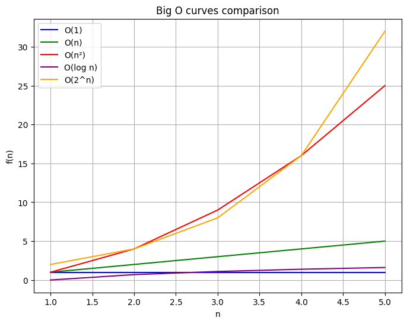

# [BR] Notação Big O

A Notação Big O é uma notação matemática usada para descrever o desempenho ou a complexidade de um algoritmo. Ela fornece uma maneira de expressar como os requisitos de tempo de execução ou espaço de um algoritmo crescem em relação ao tamanho da entrada. Neste guia, exploraremos a Notação Big O em detalhes, sua importância e como calculá-la, com exemplos e ilustrações visuais.

---

## 1. O que é a Notação Big O?

A Notação Big O é usada para classificar algoritmos com base em suas taxas de crescimento. Ela se concentra no pior cenário, o que ajuda os desenvolvedores a entender o limite superior do desempenho de um algoritmo.

**Conceito-chave:**

- **Tamanho da entrada ($n$):** Representa o tamanho dos dados de entrada.
- **Taxa de crescimento:** Descreve como o tempo de execução ou espaço cresce conforme o tamanho da entrada aumenta.
- **Termo dominante:** O termo na função que cresce mais rápido e define a complexidade.

> Exemplo: Se um algoritmo usa $2n^2 + 3n + 1$ operações, o Big O foca apenas em $n^2$, pois ele domina o crescimento.

---

## 2. Por que a notação Big O é importante?

### 2.1. Análise de escalabilidade

O Big O ajuda a prever como um algoritmo escala com tamanhos de entrada maiores. Algoritmos que funcionam bem para entradas pequenas podem ter um desempenho ruim com grandes conjuntos de dados.

### 2.2. Comparação de desempenho

Ele permite que os desenvolvedores comparem diferentes algoritmos e escolham o mais eficiente para um determinado problema.

### 2.3. Otimização

Identificar ineficiências por meio do Big O permite otimizações para melhorar o desempenho.

---

## 3. Complexidades comuns do Big O

### 3.1. Tempo constante - $O(1)$

O tempo de execução não depende do tamanho da entrada.

```go
func getFirstElement(arr []int) int {
    return arr[0] // Sempre 1 operação.
}
```

> Exemplo: Acessando um elemento em um array.

### 3.2. Tempo Linear - $O(n)$

O tempo de execução cresce linearmente com o tamanho da entrada.

```go
func printElements(arr []int) {
    for i := 0; i < len(arr); i++ {
        fmt.Println(arr[i]) // Executa n vezes.
    }
}
```

> Exemplo: Iterando por um array.

### 3.3. Tempo Quadrático - $O(n^2)$

O tempo de execução cresce proporcionalmente ao quadrado do tamanho da entrada.

```go
func checkPairs(arr []int) {
    for i := 0; i < len(arr); i++ {
        for j := i + 1; j < len(arr); j++ {
            if arr[i] == arr[j] {
                fmt.Println("Match")
            }
        }
    }
}
```

> Exemplo: Loops aninhados para comparações de pares.

### 3.4. Tempo logarítmico - $O(log n)$

O tempo de execução diminui conforme o tamanho da entrada aumenta, frequentemente aparecendo em algoritmos de divisão e conquista.

```go
func binarySearch(arr []int, target int) int {
    left, right := 0, len(arr)-1
    for left <= right {
        mid := (left + right) / 2
        if arr[mid] == target {
            return mid
        } else if arr[mid] < target {
            left = mid + 1
        } else {
            right = mid - 1
        }
    }
    return -1
}
```

> Exemplo: Algoritmo de busca binária.

### 3.5. Tempo exponencial - $O(2^n)$

O tempo de execução dobra com cada entrada adicional, comum em algoritmos recursivos.

```go
func fibonacci(n int) int {
    if n <= 1 {
        return n
    }
    return fibonacci(n-1) + fibonacci(n-2)
}
```

> Exemplo: Calculando números de Fibonacci.

### 3.6. Análise gráfica

O gráfico abaixo mostra as curvas de crescimento de todas as complexidades discutidas acima, ilustrando suas diferenças conforme o tamanho da entrada aumenta.



---

## 4. Como calcular a complexidade do Big O

### 4.1. Etapa 1: Analise cada operação

Avalie o código linha por linha e conte as operações.

### 4.2. Etapa 2: Remova constantes

Ignore termos e coeficientes constantes, pois eles se tornam insignificantes para entradas grandes.

### 4.3. Etapa 3: Foco nos Termos Dominantes

Mantenha apenas o termo com a maior taxa de crescimento.

#### Exemplo de Análise

**Algoritmo:**

```go
func example(arr []int) {
    sum := 0           // 1 operação (O(1))
    for i := 0; i < len(arr); i++ { // O(n)
        for j := 0; j < len(arr); j++ { // O(n)
            sum += arr[j]   // O(1)
        }
    }
    fmt.Println(sum)   // O(1)
}
```

**Etapa 1:** Contar operações:

- Constante: $O(1)$ para inicialização.
- Loop externo: $O(n)$.
- Loop interno: $O(n)$.
- Total: $O(1 + n + n^2 + 1)$.

**Etapa 2:** Remova constantes:

- $O(n^2)$

**Etapa 3:** Complexidade final:

- $O(n^2)$ (Quadrática).

---

### 5. Principais conclusões

1. A Notação Big O avalia como os algoritmos escalam com o tamanho da entrada.
2. Concentre-se nos termos dominantes para determinar a complexidade.
3. Utilize-a para comparar algoritmos e otimizar o desempenho.
4. Visualize curvas de crescimento para entender melhor a escalabilidade.

---

### 6. Conclusão

A Notação Big O é um conceito fundamental para analisar e melhorar o desempenho do algoritmo. Ao entender seus princípios e aplicá-los a cenários do mundo real, os desenvolvedores podem tomar decisões informadas para criar aplicativos escaláveis ​​e eficientes.

---

### 7. Instagram

Na postagem do Instagram [Algoritmos - Big O Notation](https://www.instagram.com/p/DDw6DF1O9yP/?img_index=1) explico o que é Big O Notation, por que ela é importante e como calculá-la.
