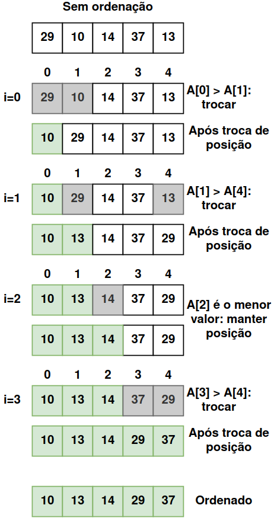

# [BR] Selection Sort — Entenda o Algoritmo Passo a Passo

O **Selection Sort** é um algoritmo de ordenação simples e intuitivo. Embora não seja o mais eficiente para grandes conjuntos de dados, é uma excelente introdução ao mundo dos algoritmos de ordenação. Neste artigo, vamos explorar como ele funciona, sua lógica, complexidade e exemplos práticos.

---

## 1. O Que é o Selection Sort?

O **Selection Sort** organiza um array dividindo-o em duas partes:
1. **Parte ordenada** – Inicialmente vazia, vai crescendo à medida que os elementos são movidos para suas posições corretas.
2. **Parte não ordenada** – Contém os elementos restantes que ainda precisam ser organizados.

A cada iteração, o algoritmo:
- Procura o menor elemento na parte não ordenada.
- Move-o para a posição correta na parte ordenada.
- Repete esse processo até que todos os elementos estejam no lugar.

---

## 2. Como Funciona o Selection Sort?

### Etapas do Algoritmo:
1. **Localize o menor elemento**: Percorra o array para encontrar o menor valor.
2. **Troque de posição**: Troque o menor elemento encontrado com o primeiro elemento da parte não ordenada.
3. **Avance a posição inicial**: Repita os passos anteriores para o restante do array.
4. Continue até que todo o array esteja ordenado.

---

## 3. Exemplo Prático: Passo a Passo

Vamos considerar o seguinte array desordenado:
```
[29, 10, 14, 37, 13]
```

<p align="center">
  
</p>

---

## 4. Implementação do algoritmo
Execute o comando shell abaixo para ver um exemplo prático do algorítmo Selection Sort. Sinta-se a vontade para alterar a variável `unsortedList` no [código](main.go) para ver como o algoritmo atua.
```sh
make selection-sort
```

---

## 5. Complexidade do Selection Sort

### **Complexidade de Tempo:**
- **Pior caso:** O(n²) — Quando o array está invertido.
- **Melhor caso:** O(n²) — Mesmo com o array já ordenado, ainda percorre todos os elementos.
- **Caso médio:** O(n²) — Independente da entrada, realiza comparações quadráticas.

### **Complexidade de Espaço:**
- **O(1)** — Utiliza apenas uma variável auxiliar para troca, ou seja, é **in-place** (não precisa de memória extra).

---

## 6. Vantagens e Desvantagens

### **Vantagens:**
- Simples de implementar.
- Funciona bem para pequenos conjuntos de dados.
- Não precisa de memória adicional (algoritmo in-place).

### **Desvantagens:**
- Ineficiente para conjuntos grandes devido à sua complexidade quadrática.
- Mesmo que o array já esteja ordenado, o algoritmo realiza todas as comparações.

---

## 7. Conclusão

O Selection Sort é um algoritmo didático e fácil de entender. Embora não seja a melhor escolha para grandes volumes de dados, é útil para ensinar conceitos fundamentais de algoritmos e estruturas de controle. Para projetos reais com grandes conjuntos de dados, algoritmos mais rápidos como **Merge Sort** e **Quick Sort** são mais recomendados.

Se você gostou dessa explicação, continue estudando algoritmos e explore diferentes técnicas de ordenação para aprimorar seu conhecimento! 🚀

## 8. Instagram
Na postagem do Instagram [Algoritmos - Selection Sort](https://www.instagram.com/p/DDw6DF1O9yP/?img_index=1) explico o algoritmo Selection Sort passo a passo com um exemplo ilustrado.

