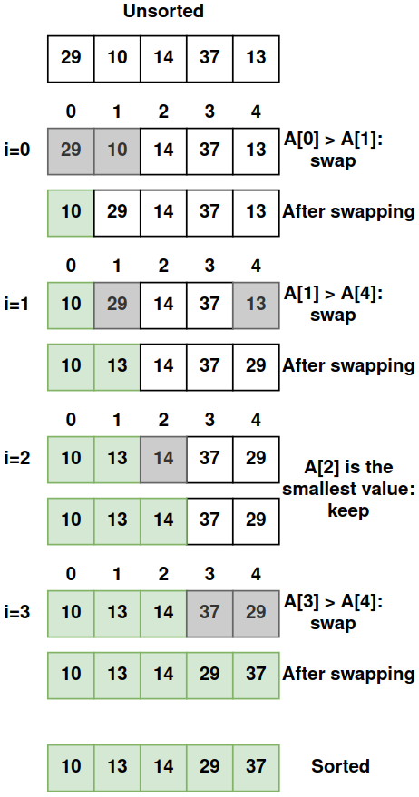

# [EN] Selection Sort — Understand the Algorithm Step by Step

**Selection Sort** is a simple and intuitive sorting algorithm. Although it is not the most efficient for large data sets, it is an excellent introduction to the world of sorting algorithms. In this article, we will explore how it works, its logic, complexity and practical examples.

---

## 1. What is Selection Sort?

**Selection Sort** organizes an array by dividing it into two parts:

1. **Sorted part** – Initially empty, it grows as the elements are moved to their correct positions.

2. **Unsorted part** – Contains the remaining elements that still need to be organized.

At each iteration, the algorithm:
- Looks for the smallest element in the unsorted part.
- Moves it to the correct position in the sorted part.
- Repeats this process until all the elements are in place.

---

## 2. How does Selection Sort work?

### Algorithm Steps:
1. **Find the smallest element**: Go through the array to find the smallest value.
2. **Swap position**: Swap the smallest element found with the first element of the unsorted part.
3. **Advance the initial position**: Repeat the previous steps for the rest of the array.
4. Continue until the entire array is sorted.

---

## 3. Practical Example: Step by Step

Let's consider the following unsorted array:
```
[29, 10, 14, 37, 13]
```

<p align="center">

</p>

---

## 4. Algorithm Implementation
Run the shell command below to see a practical example of the Selection Sort algorithm. Feel free to change the `unsortedList` variable in [code](main.go) to see how the algorithm works.
```sh
make selection-sort
```

---

## 5. Complexity of Selection Sort

### **Time Complexity:**
- **Worst case:** O(n²) — When the array is inverted.
- **Best case:** O(n²) — Even with the array already sorted, it still goes through all the elements.
- **Average case:** O(n²) — Regardless of the input, it performs quadratic comparisons.

### **Space Complexity:**
- **O(1)** — It uses only one auxiliary variable for exchange, that is, it is **in-place** (does not need extra memory).

---

## 6. Advantages and Disadvantages

### **Advantages:**
- Simple to implement.
- Works well for small data sets.
- Does not require additional memory (in-place algorithm).

### **Disadvantages:**
- Inefficient for large sets due to its quadratic complexity.
- Even if the array is already sorted, the algorithm performs all comparisons.

---

## 7. Conclusion

Selection Sort is a didactic and easy-to-understand algorithm. Although it is not the best choice for large volumes of data, it is useful for teaching fundamental concepts of algorithms and control structures. For real projects with large data sets, faster algorithms such as **Merge Sort** and **Quick Sort** are more recommended.

If you liked this explanation, keep studying algorithms and explore different sorting techniques to improve your knowledge! 🚀

## 8. Instagram
In the Instagram post [Algorithms - Selection Sort](https://www.instagram.com/p/DDw6DF1O9yP/?img_index=1) I explain the Selection Sort algorithm step by step with an illustrated example.