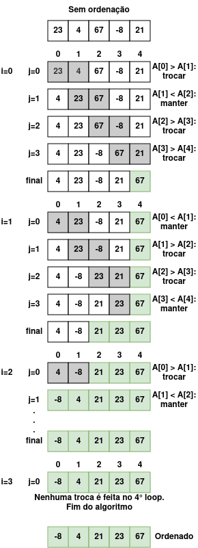

# [BR] Entendendo o Algoritmo Bubble Sort

## 1. Introdução

O **Bubble Sort** é um dos algoritmos de ordenação mais simples e intuitivos. Ele funciona comparando repetidamente elementos adjacentes em um array e os trocando de posição se estiverem fora de ordem. Esse processo é repetido até que nenhuma troca seja necessária, indicando que o array está ordenado.

Apesar de sua simplicidade, o Bubble Sort não é eficiente para grandes conjuntos de dados, mas é frequentemente utilizado para fins educacionais, pois ajuda a entender conceitos básicos de ordenação e algoritmos.

---

## 2. Como Funciona o Bubble Sort?

### Passos do Algoritmo

1. Compare dois elementos adjacentes no array.
2. Se o primeiro elemento for maior que o segundo, troque-os de posição.
3. Continue comparando os próximos pares até o final do array.
4. Repita o processo para os elementos restantes, ignorando os já ordenados no final.
5. Continue até que nenhuma troca seja necessária.

---

## 3. Exemplo Prático: Passo a Passo

Vamos considerar o seguinte array desordenado:

``` go
[23, 4, 67, -8, 21]
```

<p align="center">
  
</p>

---

## 4. Implementação do algoritmo

Execute o comando shell abaixo para ver um exemplo prático do algorítmo Bubble Sort. Sinta-se a vontade para alterar a variável `unsortedList` no [código](main.go) para ver como o algoritmo atua.

```sh
make bubble-sort
```

---

## 5. Análise de Complexidade

### Complexidade

- **Pior Caso (O(n²)):** O array está em ordem inversa e todas as comparações e trocas são necessárias.
- **Caso Médio (O(n²)):** O array está parcialmente ordenado, mas ainda assim exige múltiplas comparações.
- **Melhor Caso (O(n)):** O array já está ordenado, exigindo apenas uma verificação (sem trocas).

### Eficiência

Devido à sua complexidade quadrática, o Bubble Sort não é ideal para grandes conjuntos de dados. No entanto, sua simplicidade o torna útil para pequenas listas ou para fins educacionais.

---

## 6. Características do Algoritmo

### Vantagens

- Simples de implementar e entender.
- Funciona bem para conjuntos de dados pequenos.

### Desvantagens

- Ineficiente para grandes conjuntos devido à complexidade quadrática.
- Requer muitas trocas, o que pode ser custoso em certos contextos.

---

## 7. Conclusão

O **Bubble Sort** é um algoritmo clássico que, apesar de ser ineficiente para grandes conjuntos de dados, é útil para ensinar conceitos fundamentais de algoritmos e ordenação. Sua abordagem iterativa e intuitiva ajuda iniciantes a compreender como elementos podem ser ordenados em etapas.

Para situações onde o desempenho é crucial, algoritmos mais avançados, como Merge Sort ou Quick Sort, são preferíveis.

---

## 8. Instagram

Na postagem do Instagram [Algoritmos - Bubble Sort](https://www.instagram.com/p/DEVqNoey5Mj/?img_index=1) explico o algoritmo Bubble Sort passo a passo com um exemplo ilustrado.
