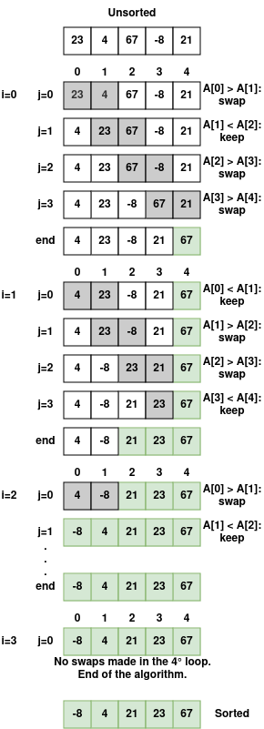

# [EN] Understanding the Bubble Sort Algorithm

## 1. Introduction

**Bubble Sort** is one of the simplest and most intuitive sorting algorithms. It works by repeatedly comparing adjacent elements in an array and swapping their positions if they are out of order. This process is repeated until no more swapping is necessary, indicating that the array is sorted.

Despite its simplicity, Bubble Sort is not efficient for large data sets, but it is often used for educational purposes, as it helps to understand basic sorting concepts and algorithms.

---

## 2. How Does Bubble Sort Work?

### Algorithm Steps

1. Compare two adjacent elements in the array.

2. If the first element is greater than the second, swap their positions.

3. Continue comparing the next pairs until the end of the array.

4. Repeat the process for the remaining elements, ignoring the ones already sorted at the end.

5. Continue until no more swapping is necessary.

---

## 3. Practical Example: Step by Step

Let's consider the following unsorted array:

``` go
[23, 4, 67, -8, 21]
```

<p align="center">

</p>

---

## 4. Algorithm Implementation

Run the shell command below to see a practical example of the Bubble Sort algorithm. Feel free to change the `unsortedList` variable in [code](main.go) to see how the algorithm works.

```sh
make bubble-sort
```

---

## 5. Complexity Analysis

### Complexity

- **Worst Case (O(n²)):** The array is in reverse order and all comparisons and exchanges are necessary. - **Average Case (O(n²)):** The array is partially sorted, but still requires multiple comparisons.
- **Best Case (O(n)):** The array is already sorted, requiring only one check (no swaps).

### Efficiency

Due to its quadratic complexity, Bubble Sort is not ideal for large data sets. However, its simplicity makes it useful for small lists or for educational purposes.

---

## 6. Algorithm Characteristics

### Advantages

- Simple to implement and understand.
- Works well for small data sets.

### Disadvantages

- Inefficient for large data sets due to quadratic complexity.
- Requires many swaps, which can be costly in certain contexts.

---

## 7. Conclusion

**Bubble Sort** is a classic algorithm that, despite being inefficient for large data sets, is useful for teaching fundamental concepts of algorithms and sorting. Its intuitive, iterative approach helps beginners understand how elements can be sorted in stages.

For situations where performance is crucial, more advanced algorithms such as Merge Sort or Quick Sort are preferable.

---

## 8. Instagram

In the Instagram post [Algorithms - Bubble Sort](https://www.instagram.com/p/DEVqNoey5Mj/?img_index=1) I explain the Bubble Sort algorithm step by step with an illustrated example.
