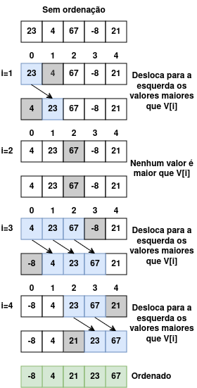

# [BR] Insertion Sort

## 1. Introdução

O algoritmo **Insertion Sort** é uma abordagem intuitiva para ordenar elementos em um array. Ele funciona de forma semelhante a como organizamos cartas em um jogo de baralho. Imagine que você está segurando um conjunto de cartas e deseja organizá-las em ordem crescente. Você pega cada carta de uma pilha e a insere na posição correta em sua mão, movendo as cartas existentes, se necessário, para abrir espaço. Da mesma forma, o Insertion Sort percorre o array, pegando cada elemento e movendo-o para sua posição apropriada, garantindo que os elementos à esquerda estejam sempre ordenados.

---

## 2. Como Funciona o Insertion Sort

### Passos

1. Comece com o segundo elemento do array (índice 1). Considere-o como o valor "chave";
2. Compare a chave com os elementos anteriores na parte ordenada;
3. Desloque os elementos maiores que a chave uma posição à frente;
4. Insira a chave na posição correta;
5. Repita o processo até ordenar todos os elementos.

---

## 3. Exemplo Prático

Vamos aplicar algoritmo **Insertion Sort** no seguinte array desordenado.

``` go
[23, 4, 67, -8, 21]
```

<p align="center">
  
</p>

---

## 4. Implementação do algoritmo

Execute o comando shell abaixo para ver um exemplo prático do algorítmo Selection Sort. Sinta-se a vontade para alterar a variável `unsortedList` no [código](main.go) para ver como o algoritmo atua.

```sh
make insertion-sort
```

---

## 5. Complexidade do Algoritmo

### **5.1. Caso Melhor:**

- **O(n)** – Quando o array já está ordenado, apenas verifica os elementos, sem movimentos.

### **5.2. Caso Pior e Médio:**

- **O(n²)** – Quando o array está invertido, o algoritmo precisa comparar e mover todos os elementos.

### Tabela de Complexidade

| Caso             | Complexidade |
|------------------|--------------|
| Melhor Caso      | O(n)         |
| Pior Caso        | O(n²)        |
| Caso Médio       | O(n²)        |

---

## 6. Vantagens e Desvantagens

### **6.1. Vantagens**

- Simples e fácil de implementar;
- Bom desempenho para listas pequenas ou quase ordenadas;
- Na prática tem um desempenho melhor que os algoritmos Bubble Sort e Selection Sort.

### **6.2. Desvantagens**

- Ineficiente para listas grandes devido à complexidade quadrática.

---

## 7. Conclusão

O algoritmo **Insertion Sort** é ideal para situações onde os dados estão próximos de uma ordem crescente ou quando lidamos com pequenas coleções. Embora não seja adequado para grandes volumes de dados, é um excelente ponto de partida para entender algoritmos de ordenação devido à sua simplicidade e abordagem intuitiva.

---

## 8. Instagram

Na postagem do Instagram [Algoritmos - insertion Sort](https://www.instagram.com/p/DEntsRqyihK/?img_index=1) explico o algoritmo Selection Sort passo a passo com um exemplo ilustrado.
