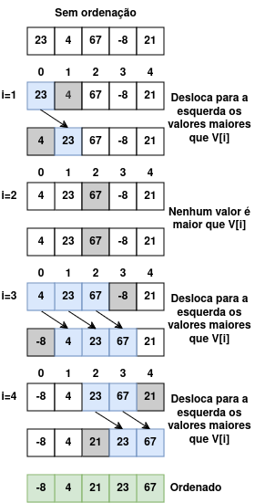

# Insertion Sort

## 1. Introduction

The **Insertion Sort** algorithm is an intuitive approach to sorting elements in an array. It works similarly to how we sort cards in a deck of cards. Imagine that you are holding a deck of cards and want to sort them in ascending order. You take each card from a stack and insert it into the correct position in your hand, moving existing cards if necessary to make room. Similarly, Insertion Sort goes through the array, taking each element and moving it to its appropriate position, ensuring that the elements to the left are always sorted.

---

## 2. How Insertion Sort Works

### Steps

1. Start with the second element of the array (index 1). Consider it the "key" value;
2. Compare the key with the previous elements in the sorted part;
3. Shift the elements greater than the key one position forward;
4. Insert the key into the correct position;
5. Repeat the process until all the elements are sorted.

---

## 3. Practical Example

Let's apply the **Insertion Sort** algorithm to the following unsorted array.

``` go
[23, 4, 67, -8, 21]
```

<p align="center">

</p>

---

## 4. Implementation of the algorithm

Run the shell command below to see a practical example of the Selection Sort algorithm. Feel free to change the `unsortedList` variable in [code](main.go) to see how the algorithm works.

```sh
make insertion-sort
```

---

## 5. Complexity of the Algorithm

### **5.1. Best Case:**

- **O(n)** – When the array is already sorted, it only checks the elements, without movements.

### **5.2. Worst and Average Case:**

- **O(n²)** – When the array is inverted, the algorithm needs to compare and move all the elements.

### Complexity Table

| Case | Complexity |
|------------------|--------------|
| Best Case | O(n) |
| Worst Case | O(n²) |
| Average Case | O(n²) |

---

## 6. Advantages and Disadvantages

### **6.1. Advantages**

- Simple and easy to implement;
- Good performance for small or almost sorted lists;
- In practice, it performs better than the Bubble Sort and Selection Sort algorithms.

### **6.2. Disadvantages**

- Inefficient for large lists due to quadratic complexity.

---

## 7. Conclusion

The **Insertion Sort** algorithm is ideal for situations where the data is close to an increasing order or when dealing with small collections. Although it is not suitable for large volumes of data, it is an excellent starting point for understanding sorting algorithms due to its simplicity and intuitive approach.

---

## 8. Instagram

In the Instagram post [Algorithms - insertion Sort](https://www.instagram.com/p/DEntsRqyihK/?img_index=1) I explain the Selection Sort algorithm step by step with an illustrated example.
