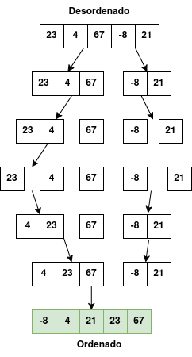

# [BR] Merge Sort

## 1. Introdução

O **Merge Sort** é um dos algoritmos de ordenação mais eficientes e amplamente usados, especialmente quando lidamos com grandes conjuntos de dados. Ele é baseado na estratégia **Divide and Conquer** (Dividir e Conquistar), que divide o problema em partes menores, resolve essas partes e, em seguida, combina os resultados para formar a solução final.

Imagine que você precisa organizar uma pilha de papéis embaralhados. O Merge Sort faz isso dividindo a pilha em pequenos grupos, ordenando esses grupos individualmente e, por fim, juntando-os de forma ordenada.

---

## 2. Como Funciona o Merge Sort?

O algoritmo segue os seguintes passos:

1. **Dividir:** Divida o array ao meio repetidamente até que cada subarray contenha apenas um elemento (um elemento está sempre ordenado por natureza).
2. **Conquistar:** Compare os elementos dos subarrays e ordene-os.
3. **Mesclar:** Combine os subarrays ordenados para formar o array final ordenado.

Essa abordagem utiliza a recursão para dividir o problema em partes menores e resolvê-las.

---

## 3. Exemplo Prático

Vamos ordenar o array **[23, 4, 67, -8, 21]** usando Merge Sort.

<p align="center">
  
</p>


---

## 4. Implementação do algoritmo

Execute o comando shell abaixo para ver um exemplo prático do algorítmo Merge Sort. Sinta-se a vontade para alterar a variável `unsortedList` no [código](main.go) para ver como o algoritmo atua.

```sh
make merge-sort
```

---

## 5. Complexidade do Merge Sort

| Caso	        | Complexidade  |
|---------------|---------------|
| Melhor caso	| O(n log n)    |
| Pior caso 	| O(n log n)    |
| Caso médio	| O(n log n)    |

A razão para essa eficiência é que o array é sempre dividido ao meio (log n divisões) e cada divisão requer O(n) operações para mesclar.

---

## 6. Vantagens e Desvantagens

### 6.1. Vantagens

- Consistência: Possui desempenho consistente de O(n log n) em todos os casos;
- Estabilidade: Mantém a ordem relativa dos elementos iguais;
- Ideal para listas grandes: Funciona muito bem com grandes conjuntos de dados.

### 6.2. Desvantagens

- Memória adicional: Requer espaço extra para armazenar os subarrays;
- Complexidade de implementação: Mais difícil de implementar em comparação com algoritmos simples como o Bubble Sort ou o Insertion Sort.

---

## 7. Merge Sort vs Outros Algoritmos

| Algoritmo	        | Melhor Caso	| Pior Caso	    | Estável?  |
|-------------------|---------------|---------------|-----------|               
| Merge Sort	    | O(n log n)	| O(n log n)	| Sim       |
| Quick Sort	    | O(n log n)	| O(n²)	        | Não       |
| Bubble Sort	    | O(n)	        | O(n²)	        | Sim       |
| Insertion Sort	| O(n)	        | O(n²)	        | Sim       |

**Nota:** Um algoritmo de ordenação é considerado estável quando preserva a ordem relativa dos elementos com valores iguais no conjunto de dados original. Isso significa que, se dois elementos possuem o mesmo valor, eles continuarão na mesma ordem no array ordenado.

---

## 8. Conclusão

O Merge Sort é uma das escolhas mais populares para ordenação devido à sua eficiência e estabilidade. Apesar de requerer mais memória, ele é altamente eficaz para grandes conjuntos de dados. Compreender seu funcionamento é essencial para desenvolver habilidades sólidas em algoritmos e estruturas de dados.

---

## 9. Instagram

Na postagem do Instagram [Algoritmos - Merge Sort](https://www.instagram.com/p/DFdxPPJyF6S/?img_index=1) explico o algoritmo Merge Sort passo a passo com um exemplo ilustrado.
