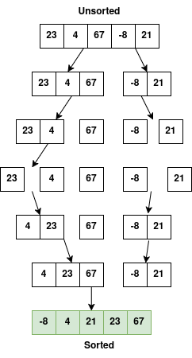

# [EN] Merge Sort

## 1. Introduction

**Merge Sort** is one of the most efficient and widely used sorting algorithms, especially when dealing with large data sets. It is based on the **Divide and Conquer** strategy, which divides the problem into smaller parts, solves these parts, and then combines the results to form the final solution.

Imagine that you need to organize a stack of shuffled papers. Merge Sort does this by dividing the stack into small groups, sorting these groups individually, and finally merging them in an ordered manner.

---

## 2. How does Merge Sort work?

The algorithm follows these steps:

1. **Divide:** Divide the array in half repeatedly until each subarray contains only one element (an element is always ordered by nature).

2. **Conquer:** Compare the elements of the subarrays and order them.

3. **Merge:** Combine the sorted subarrays to form the final sorted array.

This approach uses recursion to break the problem into smaller parts and solve them.

---

## 3. Practical Example

Let's sort the array **[23, 4, 67, -8, 21]** using Merge Sort.

<p align="center">

</p>

---

## 4. Implementation of the algorithm

Run the shell command below to see a practical example of the Merge Sort algorithm. Feel free to change the `unsortedList` variable in [code](main.go) to see how the algorithm works.

```sh
make merge-sort
```

---

## 5. Complexity of Merge Sort

| Case | Complexity | |----------------|---------------|
| Best case | O(n log n) |
| Worst case | O(n log n) |
| Average case | O(n log n) |

The reason for this efficiency is that the array is always divided in half (log n divisions) and each division requires O(n) operations to merge.

---

## 6. Advantages and Disadvantages

### 6.1. Advantages

- Consistency: It has consistent O(n log n) performance in all cases;
- Stability: It keeps the relative order of the elements the same;
- Ideal for large lists: It works very well with large data sets.

### 6.2. Disadvantages

- Additional memory: It requires extra space to store the subarrays;
- Implementation complexity: It is more difficult to implement compared to simple algorithms like Bubble Sort or Insertion Sort.

---

## 7. Merge Sort vs Other Algorithms

| Algorithm | Best Case | Worst Case | Stable? |
|-------------------|---------------|---------------|-----------|
| Merge Sort | O(n log n) | O(n log n) | Yes |
| Quick Sort | O(n log n) | O(n²) | No |
| Bubble Sort | O(n) | O(n²) | Yes |
| Insertion Sort | O(n) | O(n²) | Yes |

**Note:** A sorting algorithm is considered stable when it preserves the relative order of elements with equal values ​​in the original data set. This means that if two elements have the same value, they will remain in the same order in the sorted array.

---

## 8. Conclusion

Merge Sort is one of the most popular choices for sorting due to its efficiency and stability. Although it requires more memory, it is highly effective for large data sets. Understanding how it works is essential to developing solid skills in algorithms and data structures.

---

## 9. Instagram

In the Instagram post [Algorithms - Merge Sort](https://www.instagram.com/p/DFdxPPJyF6S/?img_index=1) I explain the Merge Sort algorithm step by step with an illustrated example.